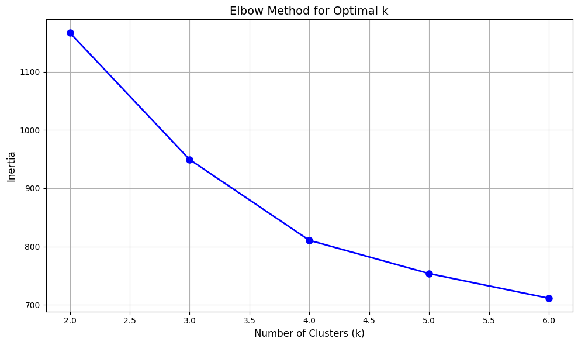
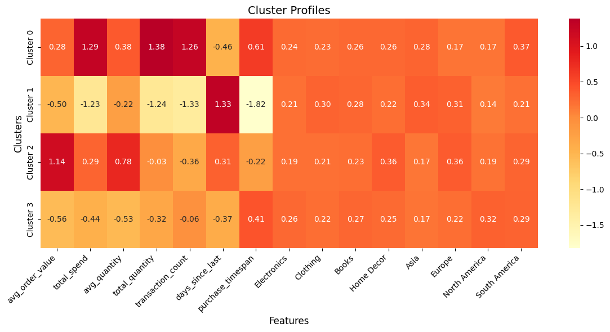

# Clustering

For feature extraction, I use the same code from Lookalike.ipynb    
KMeans was used as the clustering algorithm (since it's simple and works well) and max_clusters was set to 6.  

# Report

### 1. We got 4 different clusters
Looking at the elbow plot, we can see 4 clusters makes sense because:
The line starts to flatten after 4 and we get the best DB score with 4 clusters

### 2. DB Index = 1.4029 (lower is better, this was the best score)

### 3. Cluster Distribution:
- Cluster 3: 82 customers (41.2%) - Largest group
- Cluster 0: 46 customers (23.1%)
- Cluster 2: 42 customers (21.1%)
- Cluster 1: 29 customers (14.6%) - Smallest group

### 4. Cluster Characteristics:

##### Cluster 0 - High-Value , Active Customers (23.1%)
- Highest transaction count (1.26 std above mean)
- High total spend (1.29 std above mean)
- High total quantity (1.38 std above mean)
- Strong presence in South America (0.37) (South America has the most active and wealthy customers)

##### Cluster 1 - Low-Value , Inactive Customers (14.6%)
- Lowest transaction count (-1.33 std below mean)
- Lowest total spend (-1.23 std below mean)
- Longest time since last purchase (1.33 std above mean)
- Shortest purchase timespan (-1.82 std below mean)
- Higher presence in Asia (0.34) and Europe (0.31)

##### Cluster 2 - High-Value,  Single Purchase Customers (21.1%)
- Highest average order value (1.14 std above mean)
- Above average total spend (0.29 std above mean)
- Low transaction count (-0.36 std below mean)
- Strong preference for Home Decor (0.36)
- High presence in Europe (0.36)

##### Cluster 3 - Average Frequency, Low-Value Customers (41.2%)
- Slightly below average metrics across most variables
- Near average transaction count (-0.06)
- Below average spending (-0.44 std below mean)
- Strongest presence in North America (0.32)
- Balanced category preferences

We can use these groups to target customers differently based on their shopping patterns.